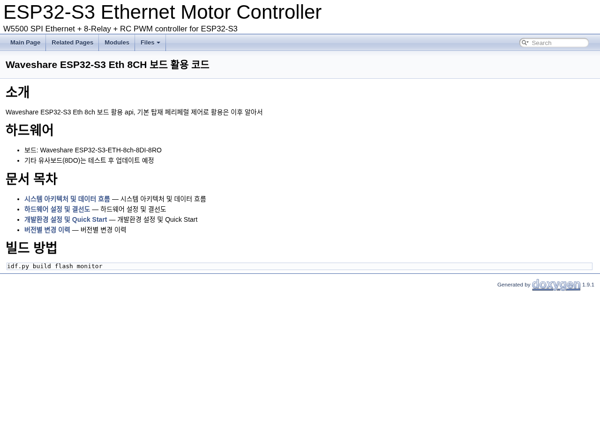
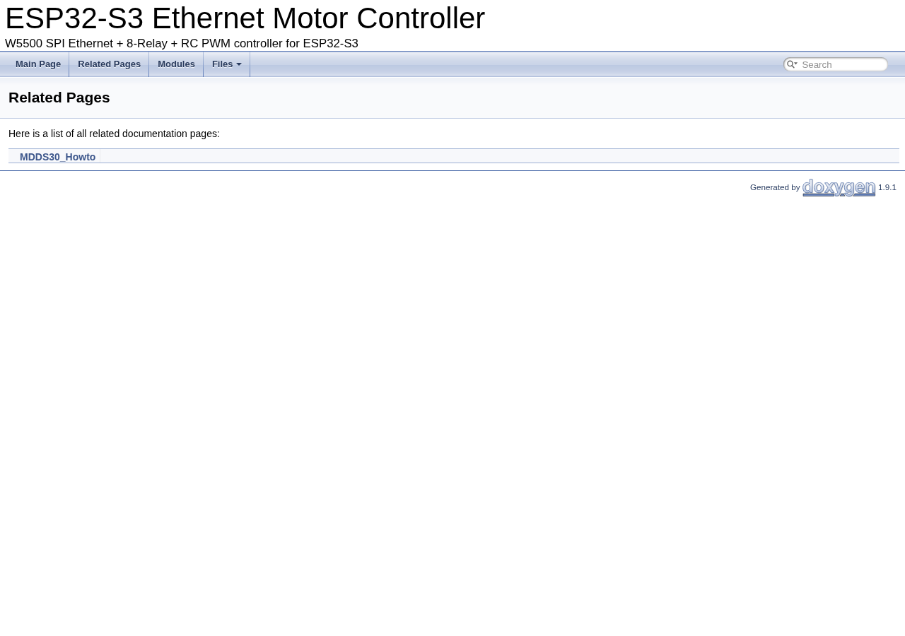

# mainpage.dox 작성 가이드

> ESP-IDF / ESP32 개발팀 내부 문서화 가이드라인

---

## 목차

1. [mainpage.dox란](#1-mainpagedox란)
2. [기본 문법](#2-기본-문법)
3. [최소 버전 — 바로 시작하기](#3-최소-버전--바로-시작하기)
4. [태그별 상세 설명](#4-태그별-상세-설명)
   - [@mainpage](#41-mainpage)
   - [@section](#42-section)
   - [@subpage](#43-subpage)
   - [@ref](#44-ref)
   - [@code / @endcode](#45-code--endcode)
5. [단계별 확장 방법](#5-단계별-확장-방법)
6. [관련 .dox 파일 작성법](#6-관련-dox-파일-작성법)
7. [태그 빠른 참조](#7-태그-빠른-참조)

---

## 1. mainpage.dox란

Doxygen HTML의 **표지(Main Page)** 를 정의하는 파일입니다. 문서 전체의 진입점이자 목차 역할을 합니다.

소스코드 주석이 "각 함수의 설명"이라면, `mainpage.dox`는 "문서 전체의 표지와 목차"입니다.

```
docs/
├── mainpage.dox        ← 이 파일이 HTML의 표지가 됨
├── hardware_setup.dox  ← @subpage로 연결되는 독립 페이지
├── changelog.dox
└── doxygen/            ← 자동 생성 출력물
```

Doxyfile의 `INPUT`에 `docs/`가 포함되어 있으면 Doxygen이 자동으로 인식합니다. 별도 설정 불필요합니다.

```ini
# Doxyfile
INPUT = main/ docs/
```

---

## 2. 기본 문법

`.dox` 파일은 C 스타일 Doxygen 블록 주석으로 작성합니다.

```c
/**
 * @mainpage 제목
 *
 * @section [내부ID] [표시될 제목]
 * 내용을 여기에 작성합니다.
 *
 * @section [내부ID2] [표시될 제목2]
 * 다음 섹션 내용.
 */
```

- 파일 전체가 하나의 주석 블록입니다.
- `@section`의 내부 ID는 영문, 공백 없이 작성합니다. 화면에는 표시되지 않습니다.
- 마크다운 문법(표, 목록, 강조)을 그대로 사용할 수 있습니다.

---

## 3. 최소 버전 — 바로 시작하기

프로젝트 초기에는 이 정도면 충분합니다. 없는 내용을 억지로 채울 필요는 없습니다.

```c
/**
 * @mainpage Waveshare ESP32-S3 Eth 8CH 보드 활용 코드
 *
 * @section intro 소개
 * Waveshare ESP32-S3 Eth 8ch 보드 활용 api, 기본 탑재 페리페럴 제어로 활용은 이후 알아서
 *
 * @section hardware 하드웨어
 * - 보드: Waveshare ESP32-S3-ETH-8ch-8DI-8RO
 * - 기타 유사보드(8DO)는 테스트 후 업데이트 예정
 *
 * @section build 빌드 방법
 * @code
 * idf.py build flash monitor
 * @endcode
 */
```

프로젝트가 진행되면서 `@subpage` 링크가 필요하면 추가합니다 (아래 섹션 5 참고).

> **결과 화면:** 위 최소 버전을 적용하면 Doxygen HTML 표지가 아래처럼 생성됩니다.
>
> 

---

## 4. 태그별 상세 설명

### 4.1 @mainpage

```c
/**
 * @mainpage Waveshare ESP32-S3 Eth 8CH 보드 활용 코드
```

`@mainpage` 바로 뒤의 텍스트가 **HTML 표지의 제목**이 됩니다. Doxyfile의 `PROJECT_NAME`과 별개이므로 보통 동일하게 맞춥니다.

> **주의:** 프로젝트 전체에 `@mainpage`는 하나만 존재해야 합니다. 두 개 이상이면 충돌합니다.

---

### 4.2 @section

```c
 * @section intro 소개
 * @section hardware 하드웨어
 * @section build 빌드 방법
```

페이지 안의 소제목을 만듭니다. 형식은 다음과 같습니다.

```
@section  [내부ID]  [화면에 표시될 제목]
              ↑              ↑
         영문, 공백 없음    한글 가능
```

| 항목 | 설명 |
|---|---|
| 내부 ID | 영문, 공백 없이 작성. 화면에 보이지 않음. 페이지 내에서 중복 금지 |
| 표시 제목 | 한글 가능. HTML에서 소제목으로 렌더링됨 |

```c
/* 좋은 예 */
@section hw_setup 하드웨어 설정
@section quick_start 빠른 시작

/* 나쁜 예 — 내부 ID에 공백 사용 */
@section hw setup 하드웨어 설정   ❌
```

---

### 4.3 @subpage

다른 `.dox` 파일의 `@page`와 연결되는 링크를 생성합니다. HTML의 Related Pages 섹션에 해당 페이지가 나타납니다.

```c
 * @section pages 문서 목차
 * - @subpage architecture    — 시스템 아키텍처 및 데이터 흐름
 * - @subpage hardware_setup  — 하드웨어 설정 및 결선도
 * - @subpage getting_started — 개발환경 설정 및 Quick Start
 * - @subpage changelog       — 버전별 변경 이력
```

`hardware_setup`은 별도 `.dox` 파일에 아래처럼 정의된 **페이지 ID**와 반드시 일치해야 합니다.

```c
/* docs/hardware_setup.dox */
/**
 * @page hardware_setup 하드웨어 설정
 * ...
 */
```

> **주의:** 대응하는 `@page`가 없는 `@subpage`를 쓰면 Doxygen이 경고를 출력합니다. 아직 해당 `.dox` 파일이 없다면 `@subpage` 줄을 통째로 삭제하세요.

> **결과 화면:** `@subpage`로 등록된 페이지들은 HTML 상단 탭의 **Related Pages**에 아래처럼 나열됩니다.
>
> 

---

### 4.4 @ref

소스코드의 `@defgroup`으로 정의된 모듈 그룹으로 연결되는 링크를 생성합니다.

```c
 * @section modules 주요 모듈
 * - @ref EXIO         — TCA9554 IO 익스팬더 드라이버
 * - @ref RelayControl — 8채널 릴레이 제어
 * - @ref PWMControl   — RC PWM 출력 제어 (Cytron MDDS30)
 * - @ref TCPServer    — TCP 명령 서버 (포트 8080)
 * - @ref EthInit      — W5500 SPI Ethernet 드라이버
```

`EXIO`는 소스코드 어딘가에 아래처럼 정의되어 있어야 합니다.

```c
/* main/exio.h */
/**
 * @defgroup EXIO TCA9554 IO 익스팬더 드라이버
 * @brief    I2C 기반 8채널 디지털 출력 확장 모듈
 * @ingroup  HardwareDrivers
 */
```

> **주의:** `@defgroup`이 정의되지 않은 이름을 `@ref`로 참조하면 링크가 깨집니다. 코드에 `@defgroup`을 먼저 작성한 후 `@ref`를 추가하세요.

---

### 4.5 @code / @endcode

코드 예시 블록을 삽입합니다.

```c
 * @section build 빌드 방법
 * @code
 * idf.py build flash monitor
 * @endcode
```

`@code` 단독 사용 시 C 언어로 인식해 구문 강조가 적용됩니다. 셸 명령어처럼 C가 아닌 내용은 `{.sh}` 또는 `{.unparsed}`를 붙입니다.

```c
 * @code{.sh}
 * idf.py build flash monitor
 * @endcode

 * \dot
 * digraph SystemDataFlow {
 *     node [shape=box, fontname="Helvetica", fontsize=10];
 *     edge [fontname="Helvetica", fontsize=9];
 *     Network   [label="네트워크 (TCP)", shape=ellipse, style=filled, fillcolor=lightblue];
 *     TCPServer [label="TCP 서버\n(tcp_server.c)"];
 *     Relay     [label="릴레이 제어\n(relay_ctrl.c)"];
 *     Network -> TCPServer [label=" 명령 수신", dir=both];
 *     TCPServer -> Relay   [label=" 릴레이 ON/OFF"];
 * }
 * \enddot
```

---

## 5. 단계별 확장 방법

처음부터 완성된 형태를 만들 필요 없습니다. 개발 단계에 맞게 채워나갑니다.

### 프로젝트 시작 시 — 최소 버전

```c
/**
 * @mainpage Waveshare ESP32-S3 Eth 8CH 보드 활용 코드
 *
 * @section intro 소개
 * Waveshare ESP32-S3 Eth 8ch 보드 활용 api, 기본 탑재 페리페럴 제어로 활용은 이후 알아서
 *
 * @section hardware 하드웨어
 * - 보드: Waveshare ESP32-S3-ETH-8ch-8DI-8RO
 * - 기타 유사보드(8DO)는 테스트 후 업데이트 예정
 *
 * @section build 빌드 방법
 * @code
 * idf.py build flash monitor
 * @endcode
 */
```

### 모듈이 생길 때 — @ref 추가

```c
 * @section modules 주요 모듈
 * - @ref EXIO         — TCA9554 IO 익스팬더 드라이버
 * - @ref RelayControl — 8채널 릴레이 제어
 * - @ref PWMControl   — RC PWM 출력 제어
 * - @ref TCPServer    — TCP 명령 서버
```

### 문서가 많아질 때 — @subpage 추가

```c
 * @section pages 문서 목차
 * - @subpage architecture    — 시스템 아키텍처 및 데이터 흐름
 * - @subpage hardware_setup  — 하드웨어 설정 및 결선도
 * - @subpage getting_started — 개발환경 설정 및 Quick Start
 * - @subpage changelog       — 버전별 변경 이력
```

---

## 6. 관련 .dox 파일 작성법

`@subpage`로 연결되는 독립 페이지입니다. 각 파일은 `@page` 하나로 시작합니다.

### hardware_setup.dox 예시

```c
/**
 * @page hardware_setup 하드웨어 설정 및 결선도
 *
 * @section board_overview 보드 개요
 * Waveshare ESP32-S3-ETH-8CH-8DI-8RO 보드 기반.
 *
 * @section pinout 핀 배치
 * @subsection eth_pins Ethernet 핀 (W5500 SPI)
 * | 신호   | GPIO |
 * |--------|------|
 * | MOSI   | 11   |
 * | MISO   | 13   |
 * | CLK    | 12   |
 * | CS     | 10   |
 * | INT    | 9    |
 *
 * @subsection i2c_pins I2C 핀 (EXIO)
 * | 신호 | GPIO | 주소   |
 * |------|------|--------|
 * | SDA  | 6    | 0x20   |
 * | SCL  | 7    |        |
 *
 * @subsection pwm_pins PWM 출력 핀
 * - CH1: GPIO47, CH2: GPIO48
 * - 범위: 1000 ~ 2000 µs (neutral: 1500 µs)
 */
```

### changelog.dox 예시

```c
/**
 * @page changelog 변경 이력
 *
 * @section v0_2_0 v0.2.0 (2025-03-09)
 * - RC PWM 출력 채널 추가 (Cytron MDDS30 지원)
 * - TCP 명령어 프로토콜 확장 (PWM N UUUU)
 * - 릴레이 상태 피드백 추가
 *
 * @section v0_1_0 v0.1.0 (2025-03-01)
 * - W5500 Ethernet 초기화
 * - TCP 서버 구현 (기본 RELAY 명령)
 * - EXIO TCA9554 드라이버 구현
 * - 8채널 릴레이 제어 API
 */
```

---

## 7. 태그 빠른 참조

```
/* ── mainpage.dox 전용 ────────────────── */
@mainpage   HTML 표지 제목 (프로젝트당 1개)
@section    페이지 내 소제목
@subpage    다른 @page로 연결되는 링크
@ref        @defgroup 모듈로 연결되는 링크

/* ── 코드 블록 ────────────────────────── */
@code           C 코드 블록 (구문 강조)
@code{.sh}      셸 명령어 블록
\dot            Graphviz 등 다이어그램 블록
\enddot         다이어그램 블록 종료

/* ── 주의사항 ─────────────────────────── */
@mainpage  → 프로젝트당 1개만
@subpage   → 대응하는 @page 파일이 반드시 있어야 함
@ref       → 대응하는 @defgroup이 반드시 있어야 함
@section   → 내부 ID는 영문, 공백 없이
```
