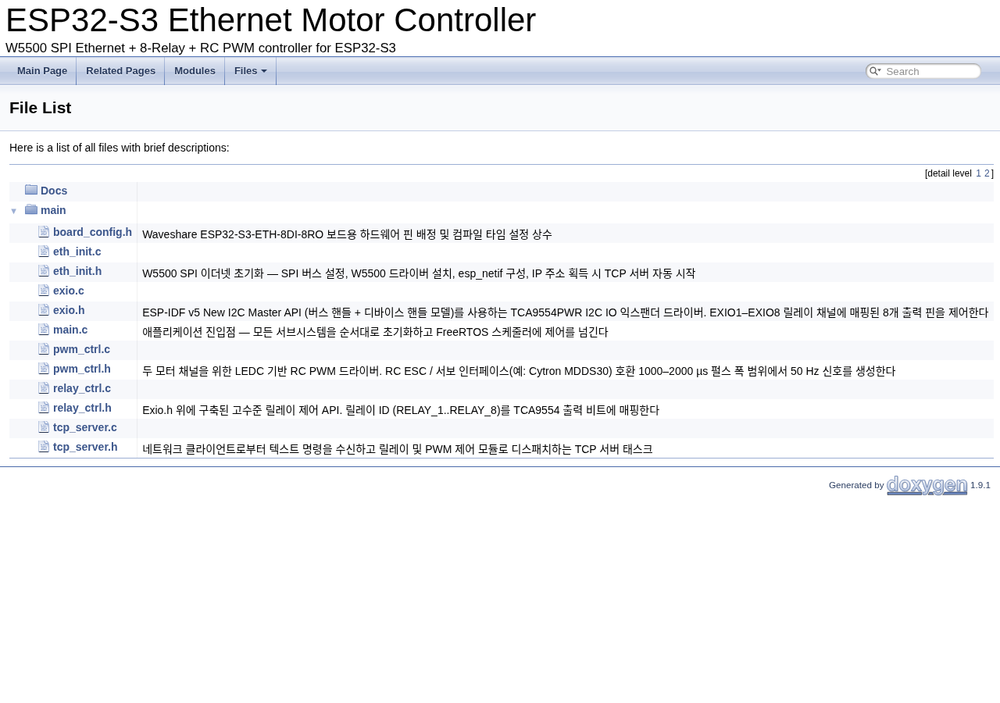

# Doxyfile 설정 가이드

> ESP-IDF / ESP32 개발팀 내부 문서화 가이드라인

---

## 목차

1. [Doxyfile이란](#1-doxyfile이란)
2. [기본 문법](#2-기본-문법)
3. [최소 설정 — 바로 시작하기](#3-최소-설정--바로-시작하기)
4. [항목별 상세 설명](#4-항목별-상세-설명)
   - [프로젝트 기본 정보](#41-프로젝트-기본-정보)
   - [입력 경로](#42-입력-경로--무엇을-읽을지)
   - [추출 범위](#43-추출-범위--무엇을-문서화할지)
   - [HTML 출력](#44-html-출력)
   - [그래프 생성](#45-그래프-생성--call-graph--의존성)
   - [문서 구조](#46-문서-구조--main-page-연동)
   - [품질 관리](#47-품질-관리)
5. [심화 설정 — 필요할 때 추가하기](#5-심화-설정--필요할-때-추가하기)
   - [검색 기능](#51-검색-기능)
   - [소스코드 브라우저](#52-소스코드-브라우저)
   - [예제 코드 연동](#53-예제-코드-연동)
   - [외관 커스터마이징](#54-외관-커스터마이징)
6. [실행 방법](#6-실행-방법)
7. [설정 항목 빠른 참조](#7-설정-항목-빠른-참조)

---

## 1. Doxyfile이란

Doxygen의 설정 파일입니다. "어느 폴더를 읽을지, 무엇을 출력할지, 그래프는 그릴지" 등 Doxygen의 모든 동작을 이 파일 하나로 제어합니다.

프로젝트 루트에 `Doxyfile`이라는 이름으로 두는 것이 관례이며, Git으로 함께 관리합니다.

```
eth_motor/
├── Doxyfile          ← 여기에 위치
├── main/
├── Docs/
└── docs/doxygen/     ← 출력 결과물 (Git 제외 권장)
```

기본 파일은 터미널에서 아래 명령 한 번으로 생성됩니다.

```bash
doxygen -g
```

약 2,000줄짜리 파일이 만들어지지만, 대부분은 주석 처리된 기본값이고 실제로 손댈 항목은 20개 안팎입니다.

> **팁:** 자동 생성된 파일을 그대로 쓰기보다, 아래 최소 설정을 새 파일로 작성하고 필요할 때 항목을 추가하는 방식이 관리하기 훨씬 편합니다.

---

## 2. 기본 문법

전체 설정은 `KEY = VALUE` 형태의 단순한 텍스트입니다.

```ini
PROJECT_NAME = "My ESP32 Project"   # 문자열은 따옴표
RECURSIVE    = YES                  # 불리언은 YES / NO
GENERATE_LATEX = NO

# 목록 값은 공백으로 구분
INPUT = main/ Docs/

# 줄이 길면 백슬래시로 이어쓰기 가능
EXCLUDE_PATTERNS = */build/*     \
                   */test/*      \
                   */managed_components/*
```

- `#`으로 시작하는 줄은 주석입니다.
- 값이 없으면 기본값이 적용됩니다.
- 경로는 Doxyfile 기준 상대경로로 작성합니다.

---

## 3. 최소 설정 — 바로 시작하기

아래 내용을 `Doxyfile`로 저장하면 바로 사용할 수 있습니다.
항목별 상세 설명은 [4장](#4-항목별-상세-설명)을 참조하세요.

```ini
# ── 프로젝트 ──────────────────────────────────────────────
PROJECT_NAME    = "ESP32-S3 Ethernet Motor Controller"
PROJECT_VERSION = "1.0.0"
PROJECT_BRIEF   = "W5500 SPI Ethernet + 8-Relay + RC PWM controller for ESP32-S3"
OUTPUT_DIRECTORY = docs/doxygen

# ── 입력 ──────────────────────────────────────────────────
INPUT            = main/ Docs/
FILE_PATTERNS    = *.c *.h *.dox
RECURSIVE        = YES
EXCLUDE_PATTERNS = */build/*              \
                   */managed_components/* \
                   */howto_document/*

# ── 추출 ──────────────────────────────────────────────────
EXTRACT_ALL    = YES
EXTRACT_STATIC = YES

# ── 출력 ──────────────────────────────────────────────────
GENERATE_HTML  = YES
GENERATE_LATEX = NO

# ── 그래프 (Graphviz 설치 필요) ───────────────────────────
HAVE_DOT            = YES
CALL_GRAPH          = YES
CALLER_GRAPH        = YES
INCLUDE_GRAPH       = YES
DOT_IMAGE_FORMAT    = svg
MAX_DOT_GRAPH_DEPTH = 3

# ── 문서 구조 ─────────────────────────────────────────────
USE_MDFILE_AS_MAINPAGE = README.md

# ── 품질 관리 ─────────────────────────────────────────────
WARN_IF_UNDOCUMENTED = YES
SHOW_DIRECTORIES     = YES
```

---

## 4. 항목별 상세 설명

### 4.1 프로젝트 기본 정보

```ini
PROJECT_NAME     = "ESP32-S3 Ethernet Motor Controller"
PROJECT_VERSION  = "1.0.0"
PROJECT_BRIEF    = "W5500 SPI Ethernet + 8-Relay + RC PWM controller for ESP32-S3"
OUTPUT_DIRECTORY = docs/doxygen
```

#### PROJECT_NAME

HTML 상단과 모든 페이지 타이틀에 표시됩니다. GitHub 저장소 이름과 동일하게 맞추면 혼선이 없습니다.

#### PROJECT_VERSION

HTML 헤더에 버전 번호가 함께 표시됩니다. 수동으로 직접 수정하는 방식이 가장 단순하지만, 실수로 업데이트를 잊는 경우가 많습니다. 아래 두 가지 방법 중 팀 상황에 맞는 것을 선택하세요.

**방법 1 — 수동 수정 (단순한 프로젝트에 적합)**

릴리즈할 때마다 Doxyfile을 직접 열어 수정합니다.

```ini
PROJECT_VERSION = "1.2.0"   # 릴리즈 시 직접 변경
```

**방법 2 — 스크립트로 자동화 (권장)**

`CMakeLists.txt`나 별도 `VERSION` 파일에서 버전을 읽어 Doxyfile에 주입합니다. 버전을 한 곳에서만 관리할 수 있어 누락 실수가 없습니다.

```bash
# generate_docs.sh 예시
VERSION=$(cat VERSION)   # VERSION 파일에서 읽기
sed -i "s/^PROJECT_VERSION.*/PROJECT_VERSION = \"$VERSION\"/" Doxyfile
doxygen Doxyfile
```

```
project/
├── VERSION      ← "1.2.0" 한 줄만 작성
├── Doxyfile
└── ...
```

#### PROJECT_BRIEF

HTML 헤더의 프로젝트 이름 옆에 작은 글씨로 표시되는 한 줄 소개입니다.

**좋은 BRIEF의 조건:**

- 20~40자 이내의 한 문장
- "무엇을 하는 프로젝트인가"를 즉시 전달
- 기술 스택보다 목적 중심으로 작성

```ini
# 좋은 예 — 목적이 명확
PROJECT_BRIEF = "W5500 SPI Ethernet + 8-Relay + RC PWM controller for ESP32-S3"
PROJECT_BRIEF = "TCP 명령 기반 8채널 릴레이·PWM 제어 펌웨어"

# 나쁜 예 — 너무 추상적이거나 기술 나열
PROJECT_BRIEF = "ESP32 펌웨어"
PROJECT_BRIEF = "C, FreeRTOS, Ethernet, I2C, PWM 사용 프로젝트"
```

#### OUTPUT_DIRECTORY

생성된 HTML 파일이 저장될 경로입니다. `docs/doxygen`처럼 명시해두면 `.gitignore`에 한 줄로 제외하기 편합니다.

```gitignore
# .gitignore
docs/doxygen/
```

---

### 4.2 입력 경로 — 무엇을 읽을지

```ini
INPUT            = main/ Docs/
FILE_PATTERNS    = *.c *.h *.dox
RECURSIVE        = YES
EXCLUDE_PATTERNS = */build/*              \
                   */managed_components/* \
                   */howto_document/*
```

#### INPUT

Doxygen이 파싱할 폴더 또는 파일을 공백으로 구분해 나열합니다. `README.md`를 Main Page로 사용한다면 이 목록에도 추가해야 합니다.

```ini
INPUT  = main/ Docs/ README.md
```

#### FILE_PATTERNS

읽어들일 파일 확장자를 지정합니다. `*.dox`는 `@mainpage`나 `@page`를 담은 전용 문서 파일입니다.

#### RECURSIVE

`YES`로 설정하면 하위 폴더를 모두 재귀 탐색합니다. ESP-IDF 프로젝트처럼 폴더 깊이가 있는 구조에서는 반드시 켜두세요.

#### EXCLUDE_PATTERNS

**ESP-IDF에서 반드시 설정해야 하는 항목입니다.**

`managed_components/`를 제외하지 않으면 Espressif 라이브러리 전체가 파싱되어 문서가 수천 페이지로 불어납니다.

```ini
EXCLUDE_PATTERNS = */build/*              \
                   */managed_components/* \
                   */howto_document/*     \
                   */test/*               \
                   *_test.c
```

---

### 4.3 추출 범위 — 무엇을 문서화할지

```ini
EXTRACT_ALL    = YES
EXTRACT_STATIC = YES
EXTRACT_PRIVATE = NO
```

#### EXTRACT_ALL

| 값 | 동작 |
|---|---|
| `YES` | `@brief` 주석이 없는 심볼도 목록에 포함 |
| `NO` | Doxygen 주석이 달린 항목만 문서화 |

처음에는 `YES`로 놓고 전체 구조를 파악한 뒤, 팀 내 표준이 자리 잡히면 `NO`로 전환하면 "주석 없는 항목이 문서에서 사라진다"는 자연스러운 동기부여가 됩니다.

#### EXTRACT_STATIC

`YES`로 설정하면 `static` 함수도 문서에 포함됩니다. 내부 구현 함수까지 보고 싶다면 켜두세요.

---

### 4.4 HTML 출력

```ini
GENERATE_HTML  = YES
HTML_OUTPUT    = html
GENERATE_LATEX = NO
```

#### GENERATE_LATEX

기본값이 `YES`이므로 **반드시 `NO`로 변경해야 합니다.** LaTeX 환경이 없는 상태에서 `YES`로 두면 빌드 후 오류 메시지가 쏟아집니다.

#### HTML_OUTPUT

`OUTPUT_DIRECTORY` 하위에 생성될 폴더 이름입니다. 기본값 `html`을 그대로 두면 `docs/doxygen/html/index.html`이 생성됩니다.

> **결과 화면:** HTML 출력이 완료되면 브라우저에서 Files 탭이 아래처럼 표시됩니다.
>
> 

---

### 4.5 그래프 생성 — Call graph / 의존성

```ini
HAVE_DOT            = YES
CALL_GRAPH          = YES
CALLER_GRAPH        = YES
INCLUDE_GRAPH       = YES
DOT_IMAGE_FORMAT    = svg
MAX_DOT_GRAPH_DEPTH = 3
```

Graphviz(`dot` 명령어)가 설치되어 있어야 동작합니다.

```bash
# 설치 확인
dot -V

# 설치 (Ubuntu/Debian)
sudo apt install graphviz

# 설치 (macOS)
brew install graphviz
```

#### 각 그래프의 역할

| 설정 | 생성되는 그래프 | 설명 |
|---|---|---|
| `CALL_GRAPH` | 호출 그래프 | 이 함수가 무엇을 호출하는지 |
| `CALLER_GRAPH` | 피호출 그래프 | 이 함수가 어디서 호출되는지 |
| `INCLUDE_GRAPH` | 파일 의존성 | `#include` 관계 시각화 |

#### DOT_IMAGE_FORMAT

`svg`를 권장합니다. `png`에 비해 확대해도 깨지지 않고 파일 크기도 작습니다.

#### MAX_DOT_GRAPH_DEPTH

그래프 탐색 깊이를 제한합니다. 값이 클수록 그래프가 복잡해집니다. `3` 정도가 전체 구조를 파악하기에 적당합니다.

> **팁:** `HAVE_DOT = YES`만 설정하고 나머지를 켜지 않으면 그래프가 생성되지 않습니다. 세트로 설정해야 합니다.

---

### 4.6 문서 구조 — Main Page 연동

```ini
USE_MDFILE_AS_MAINPAGE = README.md
```

`README.md`를 Doxygen HTML의 표지(Main Page)로 재활용합니다. 별도 `mainpage.dox`를 작성하지 않아도 되므로 단순한 프로젝트에 적합합니다.

단, 두 방법을 동시에 사용하면 충돌하므로 하나만 선택하세요.

| 방법 | 적합한 경우 |
|---|---|
| `USE_MDFILE_AS_MAINPAGE = README.md` | 문서가 많지 않고 README로 충분할 때 |
| `docs/mainpage.dox` 별도 작성 | README와 내부 문서를 분리하고 싶을 때 |

---

### 4.7 품질 관리

```ini
WARN_IF_UNDOCUMENTED = YES
SHOW_DIRECTORIES     = YES
QUIET                = NO
```

#### WARN_IF_UNDOCUMENTED

`YES`로 설정하면 `@brief` 주석이 없는 함수/파일마다 터미널에 경고를 출력합니다.

```
exio.c:15: warning: Member exio_set_pin (function) of group EXIO is not documented.
```

코드 리뷰 전 스스로 누락을 발견하게 만드는 효과가 있습니다. 자동화 스크립트와 함께 쓰면 경고가 있을 때 빌드를 멈추게 할 수도 있습니다.

#### SHOW_DIRECTORIES

`YES`로 설정하면 HTML에 디렉터리 트리 섹션이 추가됩니다. 프로젝트 폴더 구조를 한눈에 파악할 수 있어 처음 보는 팀원에게 유용합니다.

#### QUIET

`NO`(기본값)면 실행 중 진행 상황을 터미널에 출력합니다. 자동화 스크립트에서 로그를 줄이고 싶다면 `YES`로 설정하세요.

---

## 5. 심화 설정 — 필요할 때 추가하기

아래 항목들은 최소 설정으로 시작한 뒤, 팀의 필요에 따라 하나씩 추가하세요.

### 5.1 검색 기능

```ini
SEARCHENGINE      = YES   # HTML 내 검색창 활성화 (기본 YES)
SERVER_BASED_SEARCH = NO  # 로컬 파일로 열 때는 NO 유지
```

로컬에서 `index.html`을 직접 열어 쓰는 경우 `SERVER_BASED_SEARCH = NO`를 유지해야 검색이 동작합니다. 웹 서버에 배포할 때만 `YES`로 변경하세요.

---

### 5.2 소스코드 브라우저

```ini
SOURCE_BROWSER   = YES   # HTML에서 소스코드 직접 열람
INLINE_SOURCES   = YES   # 함수 문서 페이지에 구현 코드 인라인 표시
STRIP_CODE_COMMENTS = NO # 소스 표시 시 주석 유지
```

`SOURCE_BROWSER = YES`를 켜면 HTML에서 함수 이름을 클릭했을 때 실제 소스코드로 바로 이동할 수 있습니다. 코드리뷰나 신규 팀원 온보딩에 유용합니다.

---

### 5.3 예제 코드 연동

```ini
EXAMPLE_PATH     = examples/
EXAMPLE_PATTERNS = *.c
EXAMPLE_RECURSIVE = NO
```

`examples/` 폴더의 파일을 `@example` 태그로 문서에 연결할 수 있습니다.

```c
/**
 * @example relay_basic.c
 * TCP 클라이언트에서 릴레이 ON/OFF를 제어하는 기본 예제
 */
```

> **주의:** 이 프로젝트는 현재 `examples/` 폴더를 사용하지 않으나, 별도 예제 코드를 추가할 경우 위 설정을 활용할 수 있습니다.

---

### 5.4 외관 커스터마이징

```ini
HTML_COLORSTYLE       = LIGHT   # LIGHT / DARK / AUTO
GENERATE_TREEVIEW     = YES     # 왼쪽 사이드바 네비게이션 활성화
DISABLE_INDEX         = NO      # 상단 탭 메뉴 유지
FULL_SIDEBAR          = NO      # 사이드바 전체 너비 사용 여부
```

#### GENERATE_TREEVIEW

`YES`로 설정하면 HTML 왼쪽에 파일/클래스 트리 사이드바가 생깁니다. 파일이 많아질수록 탐색이 편해집니다.

#### HTML_COLORSTYLE

`AUTO`로 설정하면 사용자의 OS 다크모드 설정을 따라갑니다.

---

## 6. 실행 방법

### 직접 실행

Doxyfile이 있는 프로젝트 루트에서 실행합니다.

```bash
doxygen Doxyfile
```

완료 후 브라우저로 열어 확인합니다.

```bash
# Linux
xdg-open docs/doxygen/html/index.html

# macOS
open docs/doxygen/html/index.html
```

### .gitignore 설정

출력 결과물은 Git에서 제외하는 것이 일반적입니다. Doxyfile만 추적하고, HTML은 필요할 때 생성합니다.

```gitignore
docs/doxygen/
```

---

## 7. 설정 항목 빠른 참조

### 최소 설정 항목

| 항목 | 권장값 | 설명 |
|---|---|---|
| `PROJECT_NAME` | 프로젝트명 | HTML 타이틀에 표시 |
| `PROJECT_VERSION` | `"1.0.0"` | 릴리즈 시 수동 또는 스크립트로 갱신 |
| `PROJECT_BRIEF` | 20~40자 목적 중심 문장 | HTML 헤더 부제 |
| `OUTPUT_DIRECTORY` | `docs/doxygen` | 출력 경로 |
| `INPUT` | `main/ Docs/` | 파싱 대상 경로 |
| `FILE_PATTERNS` | `*.c *.h *.dox` | 대상 확장자 |
| `RECURSIVE` | `YES` | 하위 폴더 재귀 탐색 |
| `EXCLUDE_PATTERNS` | `*/build/* */managed_components/*` | ESP-IDF 필수 제외 |
| `EXTRACT_ALL` | `YES` | 주석 없는 심볼도 포함 |
| `EXTRACT_STATIC` | `YES` | static 함수 포함 |
| `GENERATE_HTML` | `YES` | HTML 출력 |
| `GENERATE_LATEX` | `NO` | 반드시 비활성화 |
| `HAVE_DOT` | `YES` | Graphviz 사용 선언 |
| `CALL_GRAPH` | `YES` | 함수 호출 그래프 |
| `CALLER_GRAPH` | `YES` | 함수 피호출 그래프 |
| `INCLUDE_GRAPH` | `YES` | 파일 의존성 그래프 |
| `DOT_IMAGE_FORMAT` | `svg` | 고품질 벡터 이미지 |
| `MAX_DOT_GRAPH_DEPTH` | `3` | 그래프 복잡도 제한 |
| `WARN_IF_UNDOCUMENTED` | `YES` | 주석 누락 경고 |
| `SHOW_DIRECTORIES` | `YES` | 디렉터리 트리 표시 |

### 심화 설정 항목

| 항목 | 권장값 | 설명 |
|---|---|---|
| `SOURCE_BROWSER` | `YES` | HTML에서 소스 직접 열람 |
| `INLINE_SOURCES` | `YES` | 함수 페이지에 코드 인라인 표시 |
| `GENERATE_TREEVIEW` | `YES` | 왼쪽 사이드바 네비게이션 |
| `HTML_COLORSTYLE` | `AUTO` | OS 다크모드 자동 연동 |
| `EXAMPLE_PATH` | `examples/` | 예제 코드 폴더 연동 |
| `SERVER_BASED_SEARCH` | `NO` | 로컬 열람 시 검색 활성화 |
| `QUIET` | `YES` | 자동화 시 터미널 출력 최소화 |
